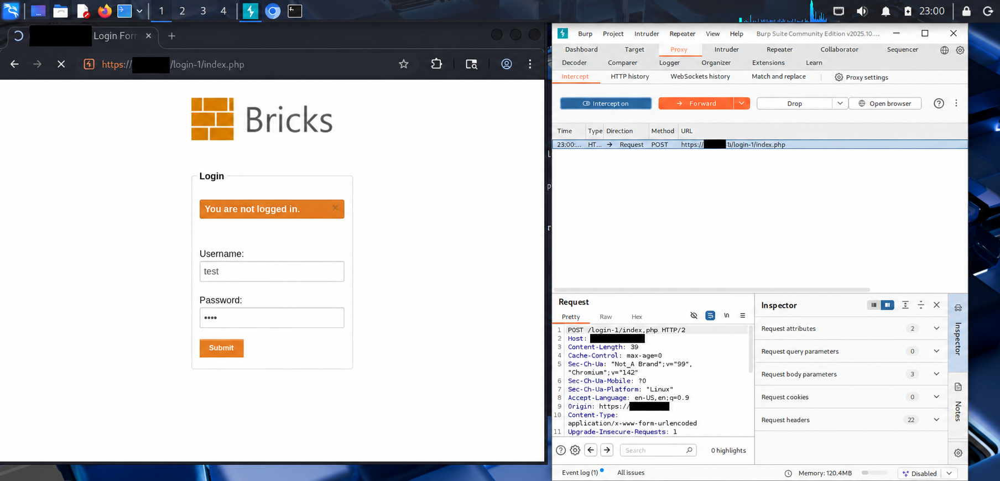
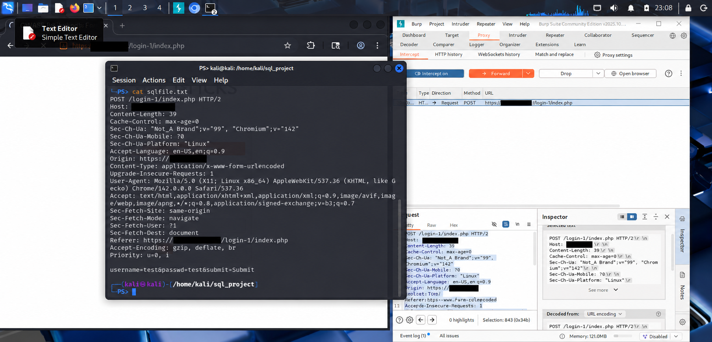
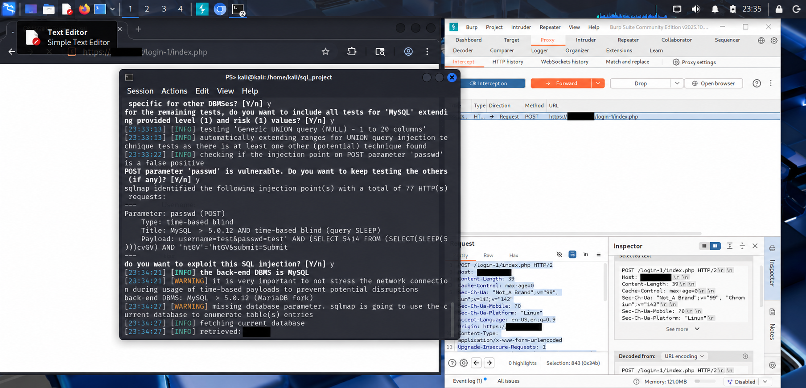
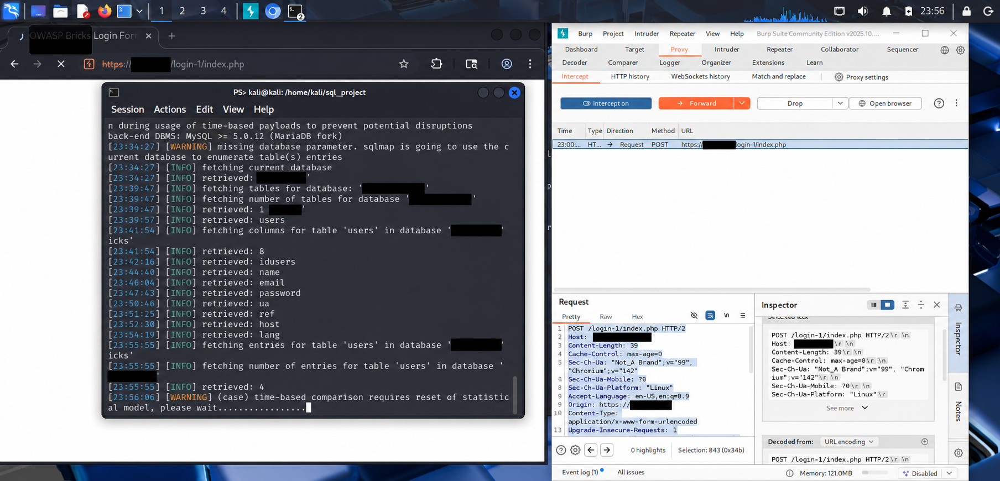

# SQL Injection Assessment of a Bricks Training Application Using Burp Suite and sqlmap

An educational web application security assessment documenting HTTP request capture, automated SQL injection testing, and database schema enumeration.

> **Screenshot note:** Images are privacy-edited copies with target identifiers redacted. AI-assisted editing may have altered small text details. Original captures are retained privately.

## Project Overview

This project examined a Bricks training application's login form using Kali Linux, Burp Suite, and sqlmap.

The assessment focused on capturing a login request, identifying its input parameters, and reviewing sqlmap's findings. The available evidence shows sqlmap reporting time-based blind SQL injection in the `passwd` POST parameter.

The screenshots also show database schema enumeration. They do not demonstrate a successful manual authentication bypass or a completed extraction of user credentials.

## Scope

- Application: Bricks training application
- Component: Login form
- Tested parameter: `passwd`
- Assessment environment: Kali Linux
- Tools: Burp Suite and sqlmap
- Context: Educational training exercise

Testing permissions and publication permissions should be confirmed separately. This repository does not grant permission to test any referenced application.

## Objectives

- Understand how login form inputs are transmitted in an HTTP request.
- Capture and inspect a request using Burp Suite.
- Assess a selected input parameter for SQL injection.
- Interpret automated findings and their limitations.
- Recommend controls that prevent SQL injection.

## Tools and Environment

| Tool | Role |
|---|---|
| Kali Linux | Assessment workstation |
| Burp Suite | Capture and inspect the login request |
| sqlmap | Automated SQL injection testing and enumeration |
| SQL payload wordlist | Review examples during preparation |
| Bricks | Training application under assessment |

## Assessment Workflow

### 1. Preparation

A SQL payload wordlist was reviewed to understand examples of SQL injection input.

The available screenshots show payload preparation. They do not establish that manual payload testing successfully bypassed authentication.

### 2. Login Request Capture

Burp Suite was used to capture the login form submission. The request contained the `username` and `passwd` parameters, populated with test values.

### 3. Saved Request Inspection

The captured request was saved to a text file and inspected in the terminal.

**Methodology limitation:** The recorded sqlmap command used `-l`, which is intended for proxy log files. sqlmap documents `-r` for loading a saved raw HTTP request.

The Burp capture shows HTTPS, while sqlmap's parsed target displays HTTP on port 80. This discrepancy limits confidence that the automated test reproduced the captured request exactly.

### 4. Automated SQL Injection Testing

sqlmap reported the `passwd` POST parameter as vulnerable to time-based blind SQL injection.

This technique uses differences in response timing to infer information when database results are not directly displayed by the application.

### 5. Database Schema Enumeration

Subsequent output showed:

- Retrieval of the current database name.
- Identification of a `users` table.
- Enumeration of eight columns.
- A reported count of four entries.

The screenshots show enumeration and an extraction attempt in progress. They do not show a completed table dump or actual extracted credentials.

## Findings

| Item | Observed result |
|---|---|
| Affected parameter | `passwd` in the POST request |
| Injection technique | Time-based blind SQL injection reported by sqlmap |
| Database backend | MySQL-compatible backend reported as a MariaDB fork |
| Enumeration | Current database, `users` table, and eight columns |
| Entry count | Four entries reported by sqlmap |
| Manual authentication bypass | Not demonstrated in the available screenshots |
| Completed credential extraction | Not demonstrated in the available screenshots |
| Remediation verification | Not performed or documented |

The database fingerprint is a tool-reported result, not an independently verified exact database version.

## Risk Interpretation

The finding indicates that user input may influence database query execution.

In a production application, SQL injection could expose data or allow unauthorized database operations, depending on the query context and database account privileges.

The demonstrated impact in this exercise is database schema enumeration. A formal severity rating is not assigned because the screenshots do not establish the full impact, privileges, or deployment context.

## Recommended Remediation

These are recommendations; implementation and retesting are not documented.

1. Use prepared statements with parameterized queries.
2. Avoid constructing SQL queries by concatenating user input.
3. Apply server-side validation appropriate to each input field.
4. Restrict the application's database account to necessary permissions.
5. Use generic client-facing errors and retain diagnostic details in protected logs.
6. Store passwords using an appropriate salted password-hashing algorithm.
7. Retest the affected parameter after remediation.

Input filtering and a web application firewall should not replace parameterized queries.

## Evidence Limitations

- A payload wordlist is not evidence of successful exploitation.
- Techniques listed while sqlmap is testing are not all confirmed findings.
- Starting a dump operation does not prove that extraction completed.
- No before-and-after remediation results are included.
- The request-loading and HTTP/HTTPS discrepancies require clarification.

## Skills Demonstrated

- HTTP request inspection
- Burp Suite request capture
- Automated SQL injection assessment
- Interpretation of time-based blind SQL injection
- Database schema enumeration
- Evidence-based security reporting
- Secure development recommendations

## References

- [OWASP SQL Injection Prevention Cheat Sheet](https://cheatsheetseries.owasp.org/cheatsheets/SQL_Injection_Prevention_Cheat_Sheet.html)
- [sqlmap Usage Documentation](https://github.com/sqlmapproject/sqlmap/wiki/Usage)

## Author

**Olayemi Owoeye**  
Cybersecurity Portfolio  
[GitHub: Yem-Tech](https://github.com/Yem-Tech)
